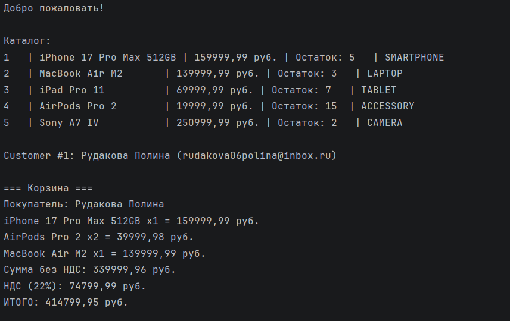
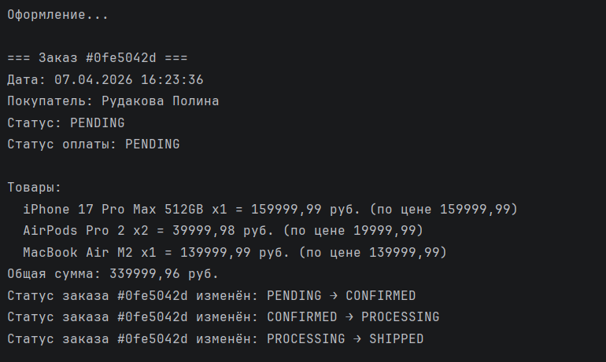
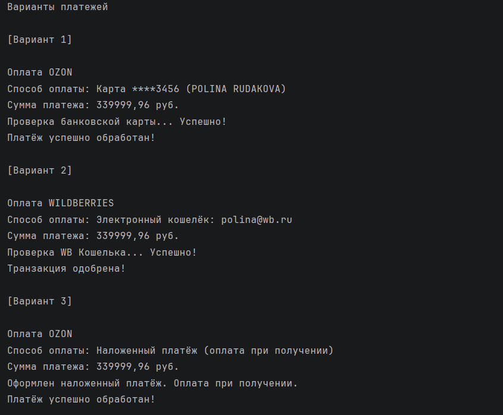
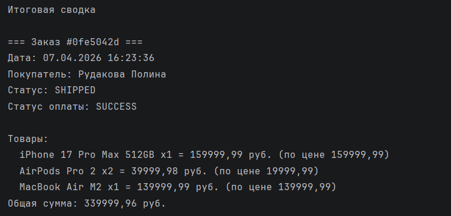
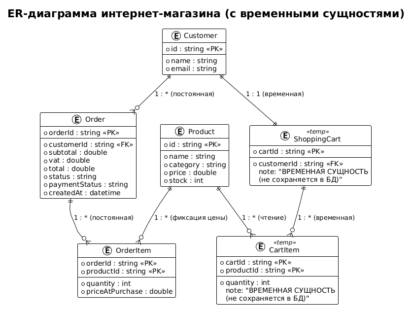

# Консольное приложение интернет-магазина

## Группа ПИ24-2в
## Участники

| № | ФИО                       | Порядковый номер в группе |
|---|---------------------------|-------------------------|
| 1 | Рудакова Полина Сергеевна | 11                      |

## Как запустить проект

### Требования
- IntelliJ IDEA Community Edition
- Java 17 или выше

### Инструкция

1. Откройте проект в IntelliJ IDEA
2. Найдите файл `ECommerceApp.java` по пути: `src/com/moderntech/ecommerce/main/ECommerceApp.java`
3. Нажмите правой кнопкой на файл → `Run 'ECommerceApp.main()'`
4. Результат работы появится в консоли

## Скриншот работы приложения

## Ключевые решения

| Средство | Где применено |
|----------|---------------|
| `record` | `Product`, `CartItem`, `OrderItem` |
| `sealed interface` | `PaymentMethod` (разрешены 3 способа оплаты) |
| `enum` | `OrderStatus`, `ProductCategory`, `PaymentStatus` |
| `ArrayList` | Хранение товаров в корзине и заказе |
| `HashMap` | Каталог товаров (быстрый поиск по ID) |
| Паттерн «Стратегия» | `Payment` — интерфейс, `OzonPayment` и `WildberriesPayment` — стратегии |

## ER-диаграмма
